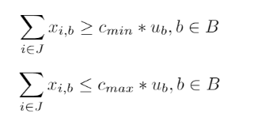

# lakritsrot
At the sailing camp SSS Rastaholm, once each week there is a day when the sailing camp spends a full day sailing. Usually this trip is to Birka, where licorice root is sold - hence the name. The participants are allowed to wish with whom they will sail and the boats are created to fulfil as many wishes as possible. To fulfil the wishes of 40 kids is no easy feat, so this webapp was created to help solve this problem.

Check out the latest version deployed at [Heroku](https://birka-algorithm.herokuapp.com/)!

## Model
 The model is implemented using Google's OR-tools and solved using the CP-SAT solver. 

### Sets

### Parameters

### Variables

### Objective function

### Constraints
#### Connecting variables

#### Capacity constrains

#### Must or can't be placed together

## License
The front end is build on top of the template [Freelancer from Start Bootstrap](https://github.com/StartBootstrap/startbootstrap-freelancer) with the [MIT](https://github.com/StartBootstrap/startbootstrap-freelancer/blob/master/LICENSE) license.